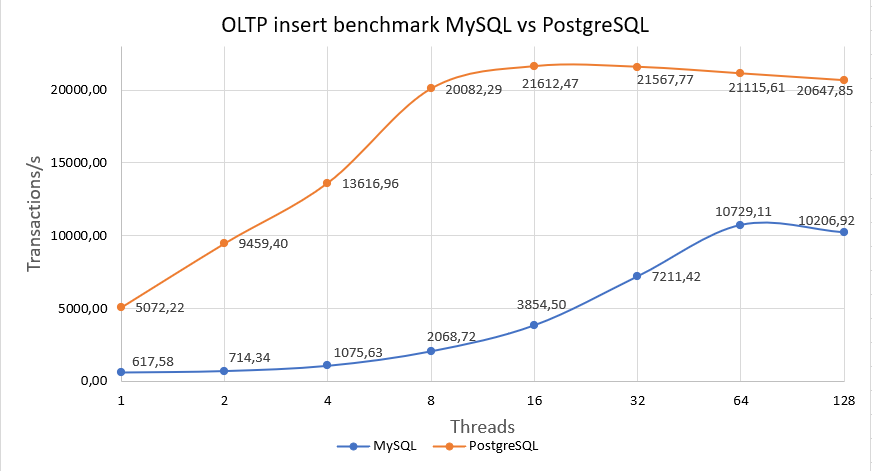
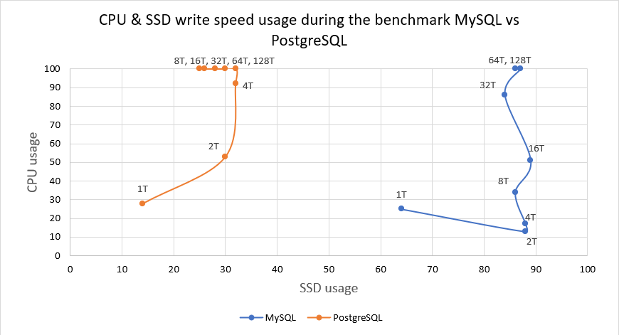

# InsertComparisonPostgreSQL-MySQL
PostgreSQL vs MySQL insertion speed comparison

MySQL and PostgreSQL are the most popular modern databases. Both databases use modern and efficient algorithms for inserting and reading data.
We tested the databases for insertion speed.
Testing was performed by creating a load typical for an OLTP scenario of using a DBMS. The databases were tested using Sysbench, a popular open-source multi-platform testing utility.

https://github.com/akopytov/sysbench

